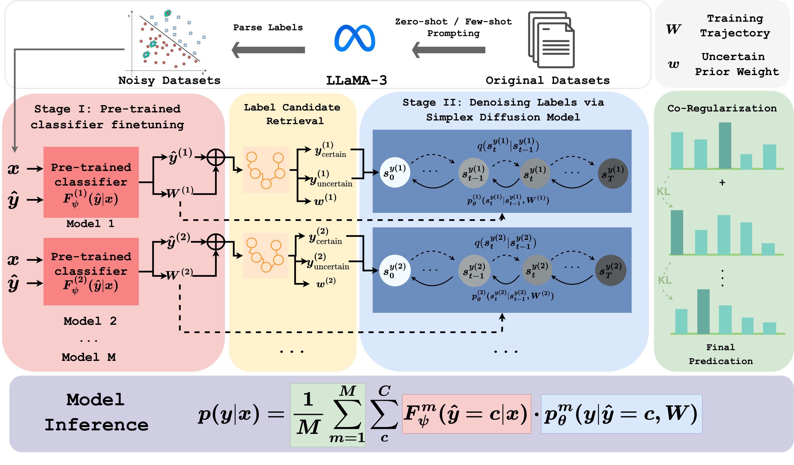

# SiDyP

Official code for our KDD'25 paper "Calibrating Pre-trained Language Classifiers on LLM-generated Noisy Labels via Iterative Refinement"





## Installation

Clone project and create environment with conda and pip:
```
conda create -n sidyp python=3.10
conda activate sidyp
pip install -r requirements.txt
```

**Note**: you may need to adjust the torch (cuda) version according to your GPU.

## LLM inference to obtain LLM-labeled data

`bash scripts/llm_inference.sh`

**Note** We use TogetherAI(https://api.together.ai) for all LLMs inference except GPT-4o. Mixtral-8x22B-Instruct-v0.1 that we use in this project is now deprecated by TogetherAI. Therefore, we provide the dataset labeled by Mixtral-8x22B-Instruct-v0.1 under `datasets/llm/zeroshot(fewshot)/mixtral822`

## Training SiDyP

`bash scripts/train.sh`

## Contact

If you have any questions or concerns, please raise GitHub issues or contact
- Liqin Ye (liqiny@gatech.edu)
- Agam Shah (ashah482@gatech.edu)

## Citation

If you find our work helpful, please consider citing our paper:

```bibtex
@inproceedings{
ye2025calibratingpretrainedlanguageclassifiers,
title={Calibrating Pre-trained Language Classifiers on LLM-generated Noisy Labels via Iterative Refinement}, 
author={Liqin Ye and Agam Shah and Chao Zhang and Sudheer Chava},
booktitle={Proceedings of the 31st ACM SIGKDD Conference on Knowledge Discovery and Data Mining},
year={2025},
url={https://arxiv.org/abs/2505.19675}
}
```
